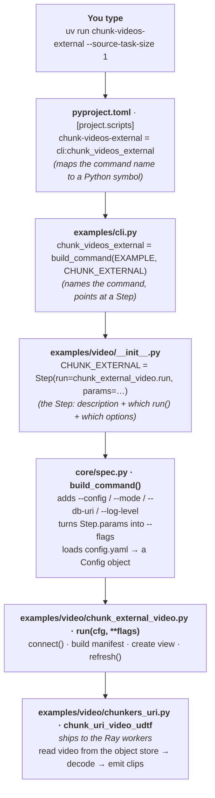
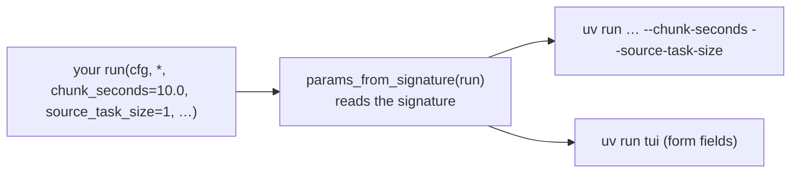

# How the CLIs hang together (start here)

New to this repo and short on time? Read this page. It explains, plainly, how
typing `uv run some-command` ends up running your Python. For "how do I add my
own," see [AUTHORING.md](AUTHORING.md).

## The one big idea

You never write a CLI by hand. You write **one plain Python function**, describe
it once as a **spec**, and the framework *generates* the command-line tool (and the
TUI) from that spec. So there's a single source of truth, not a CLI file that
drifts from the code.

Three words to know:

| Word | What it is | In code |
|---|---|---|
| **`run()`** | A plain function that does the work. First arg is always `cfg` (config); the rest are your options. | `examples/video/chunk_external_video.py` |
| **`Step`** | The *description* of one command: its name, help text, which `run()` to call, and its options. | defined in `examples/video/__init__.py` |
| **`Example`** | A group of Steps for one topic (e.g. all the `video` commands). | bottom of `examples/video/__init__.py` |

Everything else is wiring that turns a `Step` into a real `uv run` command.

## What happens when you run a command

Say you type:

```bash
uv run chunk-videos-external --source-task-size 1
```



Read it as a sentence:

1. **`pyproject.toml`** says the command name `chunk-videos-external` maps to a
   Python symbol `chunk_videos_external` in `cli.py`. *(This is why a new command
   needs `uv sync` — it regenerates these command shortcuts.)*
2. **`cli.py`** builds that symbol with `build_command(EXAMPLE, CHUNK_EXTERNAL)` —
   "make a command from this Step."
3. **`__init__.py`** is where the **Step** `CHUNK_EXTERNAL` is defined: its help text,
   which function to run (`chunk_external_video.run`), and its options (`params`).
4. **`build_command()`** (in `core/spec.py`) is the magic: it adds the four common
   options every command shares, converts the Step's `params` into `--flags`, loads
   `config.yaml` into a `Config`, and then calls your `run(cfg, **flags)`.
5. **`run()`** does the actual work: opens the connection, builds the worker package
   (manifest), creates the view, and kicks off the backfill (`refresh`).
6. The **UDF/UDTF** (the decorated function in `chunkers_uri.py`) is shipped to the
   Ray workers and runs there — that's what reads each video and emits clips.

The key insight: **steps 1–4 are pure plumbing you never edit per-command.** You only
write step 5 (`run()`) and step 6 (the UDF). The plumbing generates the rest.

## Why the options "just appear"

You don't hand-write `--source-task-size`. `build_command` calls
`params_from_signature(run)`, which **reads your `run()` function's arguments** and
turns each keyword argument into a `--flag` (name, type, and default all come from the
signature). So:

> **Add an argument to `run()` → a new `--flag` appears.** That's the whole trick.



One spec feeds **both** the command line **and** the interactive TUI — define it once,
get both.

## The files you actually touch

To add a new command you edit **the same handful of files every time** (all shown in
the diagram):

| File | You add… |
|---|---|
| `examples/<topic>/<yourtask>.py` | your `run(cfg, *, …)` function (**the work**) |
| `examples/<topic>/__init__.py` | a `Step(...)` + add it to `EXAMPLE.steps` |
| `examples/cli.py` | one `build_command(...)` line |
| `pyproject.toml` | one `[project.scripts]` line |
| then run `uv sync` | regenerates the `uv run` shortcut |

And if the command runs a model/transform, you also write a **UDF factory** (a function
that returns a `@geneva.udf` / `@geneva.chunker`), usually in a `chunkers*.py` or
`udfs/` file next to your task.

That's it. The external-video pipeline (`ingest-videos-external` →
`chunk-videos-external`) is a complete, real example of every box above — copy it when
you add your own.

➡️ Full detail, the credential/manifest story, and running at scale (hundreds of jobs):
[AUTHORING.md](AUTHORING.md).
