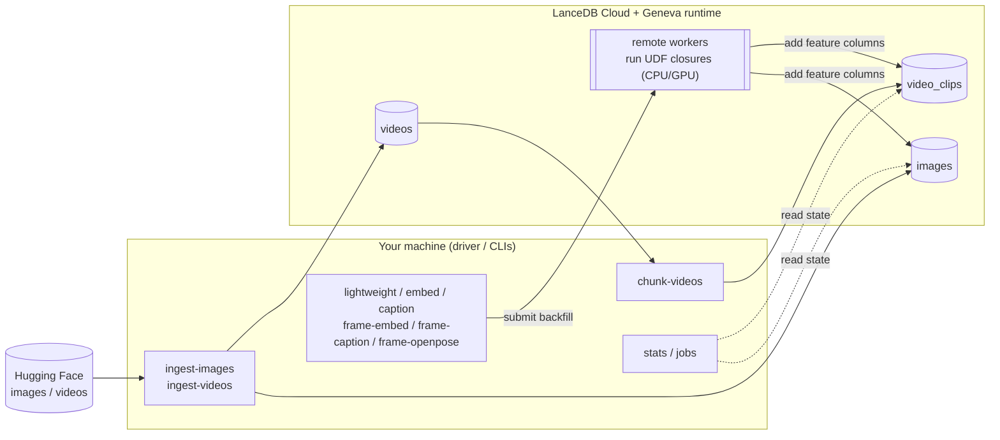

# geneva-examples — Geneva remote UDF examples

A self-contained set of **example UDFs** and the **submission tooling** to run
them against LanceDB Cloud + a remote Geneva runtime. Point it at your Geneva
host, fill in three config values, and run a backfill.

What's here:

1. **Reusable Geneva UDFs** (in [`geneva_examples/udfs/`](geneva_examples/udfs/)):
   - `imageinfo` — lightweight CPU UDFs: byte size + image dimensions
   - `clip` — OpenCLIP image embeddings
   - `blip` — BLIP image captions
   - `openpose` — OpenPose pose-skeleton PNGs
   - `chunkers` — video-chunking UDTFs (split videos into fixed-length clips)
2. **Pipeline CLIs** that ingest data and submit the UDFs as Geneva backfills.
3. **Two inspection CLIs** — `stats` and `jobs` — that read table/job state over
   the same connection.
4. **UDF Studio** — a Gradio app for prototyping UDFs/chunkers locally before
   wiring them into a stage (see below).

The UDF bodies are self-contained closures: their imports and helpers are
nested inside the factory so they ship to the remote Geneva workers via the
pinned pip manifests and run there. The driver/CLI code stays lightweight.

## Architecture

The CLIs run **on your machine** (the driver). They only submit work: ingest CLIs
load source data into LanceDB Cloud tables, and stage CLIs submit a Geneva
*backfill* that runs the UDF closures on **remote Geneva workers** (GPU-backed for
the model stages). The `stats`/`jobs` CLIs read table and job state over the same
connection.



## Requirements

- Python ≥ 3.12 and [`uv`](https://docs.astral.sh/uv/).
- A LanceDB Cloud API key + region, and a reachable Geneva host URL.
- A GPU-backed Geneva runtime for the embed/caption/openpose stages — those
  models run **remotely** in the Geneva workers, not on your machine.

## Install

```bash
uv sync
```

`geneva`, `lancedb`, and `pylance` are pinned betas served from public Gemfury
indexes (declared in [`pyproject.toml`](pyproject.toml)); `uv` resolves them
automatically — no extra flags.

## Configure

All configuration lives in a single YAML file — there is no environment-variable
fallback.

```bash
cp config-example.yaml config.yaml
# edit config.yaml
```

`config.yaml` is gitignored; `config-example.yaml` is the tracked template.

| Key               | Required | Default           | Description                                  |
| ----------------- | -------- | ----------------- | -------------------------------------------- |
| `lancedb_api_key` | **yes**  | —                 | LanceDB Cloud API key.                       |
| `lancedb_region`  | **yes**  | —                 | LanceDB Cloud region.                        |
| `geneva_host`     | **yes**  | —                 | Reachable Geneva runtime URL (load balancer).|
| `db_uri`          | no       | `db://quickstart` | Database URI, shared by every CLI.           |
| `table_name`      | no       | `images`          | Table name, shared by every CLI.             |
| `s3_*`            | no       | —                 | S3 storage creds (all four or none).         |
| `hf_token`        | no       | —                 | Hugging Face token (raises HF rate limits).  |

A missing `config.yaml`, or one missing any required field, fails with a clear
error.

## Image workflow

```bash
uv run ingest-images   # create the table + load images from a Hugging Face dataset
uv run lightweight     # backfill file_size + dimensions (CPU)
uv run embed           # backfill OpenCLIP embeddings + a text-to-image search demo (GPU)
uv run caption         # backfill two BLIP caption variants (GPU)
```

## Video workflow

```bash
uv run ingest-videos   # download MP4s into the `videos` table
uv run chunk-videos    # split into fixed-length clips + start frame -> `video_clips`
uv run frame-embed     # OpenCLIP embedding on each clip's frame
uv run frame-caption   # BLIP caption on each clip's frame
uv run frame-openpose  # OpenPose pose-skeleton PNG on each clip's frame
uv run cleanup         # drop the `videos` + `video_clips` tables
```

There is also an OpenVid variant (`ingest-videos-openvid` → `chunk-videos-openvid`)
that registers reference-only rows and chunks by reading the blob from the source
dataset, plus `seed-video-clips` for load-testing the frame stages without a full
chunk run. Run any CLI with `--help` for its options (e.g. `--chunk-seconds`,
`--model-name`/`--pretrained`/`--dim` on `frame-embed`).

## Inspecting state

```bash
uv run stats              # summarize tables: row counts, schema, populated feature columns
uv run jobs               # list active (PENDING/RUNNING) Geneva backfill jobs
uv run jobs --all         # include DONE/FAILED/CANCELLED
uv run jobs kill <job_id> # cancel a Geneva job by id
```

Both connect via `config.yaml` (override with `--config`/`--db-uri`).

## UDF Studio

A Gradio app for prototyping UDFs and chunkers before wiring them into a stage.
Pick a template, point it at sample data on disk, and run your function
**locally on the driver** (no Ray, GPU, or cluster) to see its output.

```bash
uv run udf-studio                 # http://127.0.0.1:7860, samples from ./studio_data
uv run udf-studio --data-dir ~/my-samples --library ~/udf-lib --host 0.0.0.0
```

- **Contract.** A UDF defines `transform(value)` (one input → one output); a
  chunker defines `chunk(value)` that yields one `dict` per output row. Code at
  module level runs once per Run, so load models there.
- **Sample data** comes from `--data-dir` (default `studio_data/`): drop files
  into `images/`, `videos/`, `audio/`, or rows into `input.csv` (text). See
  [`studio_data/README.md`](studio_data/README.md). The sample media itself is
  gitignored — add your own.
- **Library.** Save/load work-in-progress to a local LanceDB at `--library`
  (default `udf_library/`).
- It never builds a manifest or submits to the cluster — promoting a finished
  function to a `geneva_examples/udfs/` factory + a stage CLI stays a manual step.

## Troubleshooting & tuning

| Symptom | Where to look |
| ------- | ------------- |
| **`config file not found` / `missing required config`** | Copy `config-example.yaml` to `config.yaml` and fill in `lancedb_api_key`, `lancedb_region`, `geneva_host`. There is no env-var fallback. |
| **`declare_table` 500s / version errors** | The client must match the deployed cluster. Keep the `geneva`/`lancedb`/`pylance` pins in `pyproject.toml` aligned with the cluster build. |
| **A feature column stays `NULL` after a stage** | The backfill is async. Check it with `uv run jobs` (add `--all` for terminal states). A stage logs `null_<column>` once it returns — a non-zero count means rows were skipped (e.g. unreadable input). |
| **`required columns not visible`** | `add_columns` hasn't propagated yet. Raise `--schema-wait-attempts` / `--schema-wait-sleep-s` on the stage. |
| **Job stuck PENDING or running slowly** | Inspect with `uv run jobs`; cancel with `uv run jobs kill <job_id>`. The cluster needs free (GPU) capacity for the embed/caption/openpose stages. |
| **HF rate limits during ingest** | Set `hf_token` in `config.yaml`. |

Every stage exposes the backfill knobs as CLI options (see `--help`); defaults are
tuned for the example datasets:

| Option | Default | What it controls |
| ------ | ------- | ---------------- |
| `--backfill-concurrency` | 32 | Parallel tasks; raise to use more workers, lower to ease cluster pressure. |
| `--backfill-task-size` | 256 | Rows per task — the unit of distribution. |
| `--backfill-checkpoint-size` | 128 | Rows between checkpoints; smaller = more durable, more overhead. |
| `--backfill-flush-interval-s` | 30 | Max seconds before a partial checkpoint flush. |
| `--backfill-timeout-min` | 1000 | Per-backfill timeout. |
| `--use-cpu-only-pool` | on (CPU stages) | Route to the CPU pool; the model stages use the GPU pool. |

## Development

```bash
make install   # sync deps + install the pre-commit hook
make check     # lint + format-check + tests (the CI gate)
make test      # pytest with coverage
```

Tests exercise the UDF manifests, the pure helpers, config loading, the
`stats`/`jobs` formatting helpers, and the stage CLI wiring (mocked). See
[`CONTRIBUTING.md`](CONTRIBUTING.md) for the full workflow and how to add a new
UDF or stage.
