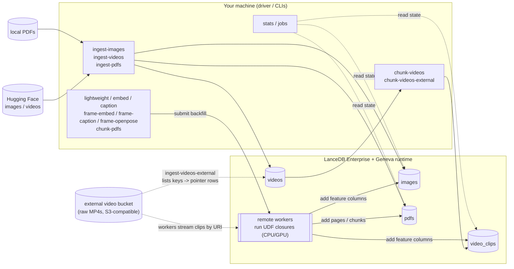

# geneva-examples — Geneva UDF examples

A self-contained set of **example UDFs** and the **pipeline tooling** to run
them with Geneva. Geneva powers two modes, and every example runs in either:

- **Local** — an on-disk Lance database with backfills on a local Ray instance.
  No cloud account, no cluster, no secrets. `git clone`, `uv sync`, and run.
- **Enterprise** — LanceDB Enterprise + a remote Geneva runtime; UDF backfills
  run on remote (GPU-backed) workers. Point it at your Geneva host, fill in three
  config values, and run a backfill.

The same UDFs, ingest CLIs, and stage CLIs are used in both modes — only the
connection target and a handful of resource knobs differ.

What's here:

1. **Self-contained example pipelines** (in
   [`geneva_examples/examples/`](geneva_examples/examples/)) — each co-locates its
   UDFs, step run-functions, and a declarative **spec** (description + tunable
   params):
   - `images` — file size/dimensions, OpenCLIP embeddings, BLIP captions
   - `video` — chunk videos into clips, then per-frame embeddings/captions/OpenPose
   - `pdf` — per-page text + overlapping chunks (Geneva's `geneva.udfs.document`)
   - shared model UDFs (OpenCLIP, BLIP) live in
     [`examples/_shared/`](geneva_examples/examples/_shared/)
2. **A Textual TUI** (`uv run tui`) that lists the examples, shows each step's
   description, renders a parameter form, and runs it with live logs.
3. **Generated CLIs** — every step is also a `uv run <name>` command, generated
   from the same spec (one source of truth for params + descriptions).
4. **Two inspection CLIs** — `stats` and `jobs` — plus `cleanup`, that read/manage
   table/job state.
5. **UDF Studio** — a Gradio app for prototyping UDFs/chunkers locally before
   promoting them into an example (see below).

Each example's spec is import-cheap; the UDF bodies are self-contained closures
whose imports/helpers nest inside the factory so they ship to remote Geneva
workers via the pinned pip manifests (enterprise), or run on local Ray (local).

Two newcomer guides go deeper: [`AUTHORING.md`](AUTHORING.md) — how to add
tasks, UDFs, and params, with the external-refs video pipeline as the worked
example — and [`CLI_ARCHITECTURE.md`](CLI_ARCHITECTURE.md) — how the
`Example → Step → Param` spec generates the CLIs and the TUI.

## Architecture

The CLIs run **on your machine** (the driver): ingest CLIs load source data into
tables, and stage CLIs run a Geneva *backfill* that executes the UDF closures.
The `stats`/`jobs` CLIs read table and job state over the same connection.

**Where the backfill runs depends on the mode.** In **enterprise** mode the
driver only submits work — the UDF closures execute on **remote Geneva workers**
(GPU-backed for the model stages), and tables live in LanceDB Enterprise. In
**local** mode the same closures run on a **local Ray** instance against an
on-disk Lance database — no packaging/manifest, no GPU, no cluster. The diagram
below shows the enterprise topology.



## Repository layout

```text
geneva-examples/
├── geneva_examples/                  # the package
│   ├── core/                         # shared infra used by every example
│   │   ├── config.py                 # load config.yaml -> Config (mode, creds, db_uri, S3)
│   │   ├── common.py                 # connect(), runtime_session, build_manifest, resolve_resources
│   │   ├── backfill.py               # backfill_column(): shared drop/add/wait/backfill flow
│   │   ├── spec.py                   # Param/Step/Example + build_command() CLI generator
│   │   ├── package_specs.py          # resolve remote-runtime pip pins from installed versions
│   │   ├── _types.py                 # structural Protocols for the Geneva/LanceDB objects
│   │   └── utils/                    # images/videos/pdfs loaders, retry_io, wait_for_columns
│   ├── examples/                     # self-contained example pipelines (the heart of the repo)
│   │   ├── __init__.py               # registry: EXAMPLES + get_example()/iter_steps()
│   │   ├── cli.py                    # generated console-script commands (one per step)
│   │   ├── _shared/                  # model UDFs shared across examples (clip, blip)
│   │   ├── images/                   # __init__ (spec) + imageinfo + ingest/lightweight/embed/caption
│   │   ├── video/                    # spec + chunkers (bytes/blob/URI) + ingest/chunk (+ openvid/external) + frame-*/seed
│   │   └── pdf/                      # spec + document UDFs + ingest/chunk
│   ├── tui/                          # Textual TUI (app.py) + form helpers (forms.py)
│   ├── ops/                          # inspection/teardown CLIs: stats, jobs, cleanup
│   └── apps/                         # local (non-cluster) apps
│       ├── udf_studio.py             # Gradio prototyping app (Typer entrypoint + UI)
│       └── studio/                   # runner / samples / templates / library
├── tests/                            # pytest suite (cluster boundary mocked)
│   ├── conftest.py                   # synthetic-media fixtures (PNG/MP4/PDF, sample data dir)
│   ├── _fakes.py                     # fake `geneva` module + FakeConn/FakeTable
│   └── test_*.py                     # unit tests + CliRunner wiring smoke tests
├── reports/                          # author-only PDF write-ups (reportlab; macOS fonts; not packaged)
├── studio_data/                      # UDF Studio sample-data dir (media gitignored; input.csv tracked)
├── config-example-local.yaml         # config.yaml template (local mode) — copy and fill in
├── config-example-enterprise.yaml    # config.yaml template (enterprise mode)
├── pyproject.toml                    # deps, cluster pins, Gemfury indexes, ruff/ty/pytest/coverage config
├── Makefile                          # dev tasks: install, check, audit, lint, format, test, typecheck…
├── AUTHORING.md                      # how to add tasks/UDFs/params (worked example: the external-refs video pipeline)
├── CLI_ARCHITECTURE.md               # how the Example → Step → Param spec generates the CLIs + TUI
├── CONTRIBUTING.md                   # setup, conventions, how to add a UDF or stage
├── SECURITY.md                       # security policy
└── .github/
    ├── workflows/ci.yml              # lint + format + tests/coverage + ty + pip-audit + secret scan
    └── dependabot.yml                # weekly dep + actions updates (cluster pins ignored)
```

## Requirements

- Python ≥ 3.12 and [`uv`](https://docs.astral.sh/uv/).
- **Local mode:** nothing else — everything runs on your machine, and it's tuned
  to fit a small box (**≈2 GB RAM / 4 cores**): local runs force `num_gpus=0`, cap
  `num_cpus`/concurrency to the machine, run one model actor at a time, cap Ray's
  memory reservation to ¼ of RAM, use small batch sizes, and default to the small
  `ViT-B-32` CLIP model. The embed/caption/openpose stages run on **CPU** (no GPU
  required) — correct, just slower than a GPU cluster.
- **Enterprise mode:** a LanceDB Enterprise API key + region, a reachable Geneva
  host URL, and a GPU-backed Geneva runtime for the embed/caption/openpose stages
  (those models run remotely in the Geneva workers).

## Install

```bash
uv sync
```

`geneva`, `lancedb`, and `pylance` are pinned betas served from public Gemfury
indexes (declared in [`pyproject.toml`](pyproject.toml)); `uv` resolves them
automatically — no extra flags.

### Two tiers of version pins

There are **two independent** sets of versions, and they are deliberately not the
same thing:

1. **The client/driver env** — `pyproject.toml` + `uv.lock`, what runs on your
   machine. Refresh it with `uv lock --upgrade` (the `==` cluster pins for
   `geneva`/`lancedb`/`pylance` hold; everything else moves to latest).
2. **The remote-worker runtime** — the `*_RUNTIME_PIP` manifests beside the UDFs
   in the [`geneva_examples/examples/`](geneva_examples/examples/) packages, the
   pip set each Geneva worker installs (enterprise mode only; local needs none).
   `geneva`/`lancedb`/`pylance` there track the installed client versions via
   `package_spec()` (so client and cluster match), but
   `torch`/`transformers`/`pyarrow`/… are **exact-pinned independently** for
   reproducible worker builds. Bumping the client lock does **not** change them
   — edit the `*_PACKAGE_SPEC` defaults (or set the matching env var) when you
   want the GPU workers on newer versions.

## Choosing a mode

Every CLI takes a `--mode {local|enterprise}` flag, and `config.yaml` has a
`mode` key. The mode is resolved with this precedence:

1. a `--mode` flag on the command,
2. the `mode` key in `config.yaml`,
3. otherwise: **enterprise** if `geneva_host` is set, else **local**.

With **no `config.yaml` at all**, the CLIs run in **local mode** — so a fresh
checkout works with zero configuration.

### Local mode (zero config)

```bash
uv sync
uv run ingest-images        # creates ./local_db and loads sample images
uv run lightweight          # file_size + dimensions (local Ray, CPU)
uv run embed                # OpenCLIP embeddings on CPU
```

Optionally pin settings by copying the template:

```bash
cp config-example-local.yaml config.yaml
```

### Enterprise mode

```bash
cp config-example-enterprise.yaml config.yaml
# edit config.yaml — fill in lancedb_api_key, lancedb_region, geneva_host
```

`config.yaml` is gitignored; `config-example-local.yaml` and
`config-example-enterprise.yaml` are per-mode templates that document every
option.

| Key               | Required        | Default           | Description                                   |
| ----------------- | --------------- | ----------------- | --------------------------------------------- |
| `mode`            | no              | `local`\*         | `local` or `enterprise` (\*inferred, see above). |
| `local_db_path`   | no              | `./local_db`      | On-disk Lance DB directory (local mode).      |
| `lancedb_api_key` | enterprise only | —                 | LanceDB Enterprise API key.                   |
| `lancedb_region`  | enterprise only | —                 | LanceDB Enterprise region.                     |
| `geneva_host`     | enterprise only | —                 | Reachable Geneva runtime URL (load balancer). |
| `db_uri`          | no              | `db://quickstart` | Database URI (enterprise); ignored locally.   |
| `s3_*`            | no              | —                 | **Storage-bucket** creds (all four or none): the connection's `storage_options` for the LanceDB data files. |
| `assets_s3_*`     | no              | —                 | **Assets-bucket** creds (all four or none): a separate token for the raw-video bucket used by the external-refs video steps (override with `--video-*`). Neither set falls back to the other. |
| `aws_allow_http`  | no              | `false`           | Allow plain-HTTP object storage (e.g. MinIO) for the connection's `storage_options`. |
| `hf_token`        | no              | —                 | Hugging Face token (raises HF rate limits).   |

In enterprise mode a missing `config.yaml`, or one missing any required field,
fails with a clear error.

Table names aren't config — each CLI declares its own `--table-name` default
(`images` for the image workflow, `videos`/`video_clips` for video, `pdfs` for
PDFs). Pass `--table-name` (or `--table` on `stats`) to point a command
elsewhere.

## Interactive runner (TUI)

```bash
uv run tui
```

A Textual app to browse, describe, tune, and run every example without
remembering command names:

- **left** — a tree of examples → steps (from the registry);
- **top-right** — the selected step's description (with GPU / prerequisite hints);
- **middle** — a form of that step's tunable parameters (defaults from the spec);
- **controls** — mode (local/enterprise), config path, db-uri, log level;
- **bottom** — a live log pane; press **Run** (or `r`) to execute the step (on
  local Ray in local mode) and watch it stream.

Every step is *also* a plain command (below), generated from the same spec — so
`uv run <name>` and the TUI always agree on parameters and descriptions.

## Image workflow

```bash
uv run ingest-images   # create the table + load images from a Hugging Face dataset
uv run lightweight     # backfill file_size + dimensions (CPU)
uv run embed           # backfill OpenCLIP embeddings (GPU); runs a local text-to-image
                       # search demo after — add --no-search-demo to skip (no driver torch)
uv run caption         # backfill a BLIP caption (GPU)
```

## Video workflow

```bash
uv run ingest-videos   # download MP4s into the `videos` table
uv run chunk-videos    # split into fixed-length clips + start frame -> `video_clips`
uv run frame-embed     # OpenCLIP embedding on each clip's frame
uv run frame-caption   # BLIP caption on each clip's frame
uv run frame-openpose  # OpenPose pose-skeleton PNG on each clip's frame
uv run cleanup         # drop the `videos` + `video_clips` tables
```

Two reference-only variants skip moving video bytes through the client:

- **OpenVid** (`ingest-videos-openvid` → `chunk-videos-openvid`) registers
  pointer rows and chunks by reading each blob from the source Lance dataset on
  the worker.
- **External bucket** (`ingest-videos-external` → `chunk-videos-external`) is
  for a corpus that already lives as native files in an S3-compatible bucket:
  ingest enumerates the bucket and writes a pointer-only `videos` table
  (`video_id` + `video_uri` + `size_mb`, no bytes — it takes seconds), and the
  chunker streams each URI on the worker with `pyarrow.fs.S3FileSystem` + PyAV
  seeking, so peak memory is bounded by decode buffers, not file size.
  Credentials come from the `assets_s3_*` block in `config.yaml` — a separate,
  typically bucket-scoped token from the storage `s3_*` creds — overridable
  per-command with the `--video-*` flags. `--sample stride` registers a pilot
  set that mirrors the corpus's size distribution instead of its smallest tail.

`frame-embed` is **incremental by default**: it only embeds clips whose
`embedding` is still null, so a partial/failed run can be re-run cheaply — run
it after the chunk job completes (the column add breaks a running chunker's
appends), and pass `--reset` to drop and recompute everything, e.g. after
switching models. `seed-video-clips` load-tests the frame stages without a full
chunk run. Run any CLI with `--help` for its options (e.g. `--chunk-seconds`,
`--model-name`/`--pretrained`/`--dim` on `frame-embed`).

## PDF workflow

Extract text chunks from PDFs. `ingest-pdfs` loads every `*.pdf` under
`--pdf-dir` (default `./studio_data/pdfs`, the bundled samples) into a `pdfs`
table (`doc_id` + `pdf_bytes`); `chunk-pdfs` then backfills two nested-list
columns using Geneva's pre-built `geneva.udfs.document` UDFs — `pages` (per-page
text via `pypdf`) and `chunks` (overlapping windows via LangChain's
`RecursiveCharacterTextSplitter`, 2048 chars / 200 overlap). Both stages run on
the **CPU** pool.

```bash
uv run ingest-pdfs                       # load ./studio_data/pdfs (or --pdf-dir ~/my-pdfs)
uv run chunk-pdfs                        # backfill `pages` + `chunks` (CPU)
```

Each PDF stays one row, carrying its `pages`/`chunks` lists — ready to embed or
explode into a per-chunk table. Prototype a PDF function first in UDF Studio
(the `pdf` modality, below) before wiring in a stage.

## Inspecting state

```bash
uv run stats                   # summarize images, videos, video_clips: rows, schema, feature columns
uv run stats --table pdfs      # summarize a specific table (repeatable)

uv run jobs                    # list active (PENDING/RUNNING) backfill jobs
uv run jobs --all              # include DONE/FAILED/CANCELLED
uv run jobs --table images     # filter by table; --status filters by exact state
uv run jobs show <job_id>      # full record for one job (--full-events for the whole log)
uv run jobs tail <job_id>      # follow a job's events until it reaches a terminal state
uv run jobs kill <job_id>      # cancel a job (prompts; -y to skip, --force if already terminal)
```

`stats` defaults to the example tables (`images`, `videos`, `video_clips`) and
skips any that are absent. Both CLIs connect via `config.yaml` (override with
`--config`/`--db-uri`).

### Debugging a job

Where `jobs` shows the raw record, `debug` interprets it: it reads the
`geneva_jobs` record and the `geneva_errors` store, samples throughput,
applies bottleneck heuristics (workers below concurrency, stalled rate, long
provisioning, stale heartbeat, skipped rows), and prints the exact commands
for the driver-pod and Ray-worker logs.

```bash
uv run debug report <job_id>          # one-shot diagnosis + guided next steps
uv run debug errors <job_id> --trace  # per-row failures with full tracebacks
uv run debug logs                     # log-retrieval commands (driver pod, Ray workers)
uv run debug watch <job_id>           # live TUI: metrics, throughput, events, findings
```

Every subcommand also takes `--replay demo_data/<file>.jsonl` to run against
recorded job snapshots instead of a live cluster — try the two bundled
scenarios before you have a failing job of your own:

```bash
uv run debug report --replay demo_data/debug_stuck_workers.jsonl
uv run debug watch  --replay demo_data/debug_healthy_run.jsonl
```

## UDF Studio

A Gradio app for prototyping UDFs and chunkers before wiring them into a stage.
Pick a template, point it at sample data on disk, and run your function
**locally on the driver** (no Ray, GPU, or cluster) to see its output.

```bash
uv run udf-studio                 # http://127.0.0.1:7860, samples from ./studio_data
uv run udf-studio --data-dir ~/my-samples --library ~/udf-lib
```

> **Security.** Studio runs the code in the editor **in-process with no
> sandbox** — keep it on the default loopback bind (`127.0.0.1`). `--host
> 0.0.0.0` or `--share` exposes arbitrary code execution to anyone who can reach
> the port; only use them on a network you trust.

- **Contract.** A UDF defines `transform(value)` (one input → one output); a
  chunker defines `chunk(value)` that yields one `dict` per output row. Code at
  module level runs once per Run, so load models there.
- **Sample data** comes from `--data-dir` (default `studio_data/`): drop files
  into `images/`, `videos/`, `audio/`, `pdfs/`, or rows into `input.csv` (text).
  See [`studio_data/README.md`](studio_data/README.md). The sample media itself
  is gitignored — add your own.
- **Library.** Save/load work-in-progress to a local LanceDB at `--library`
  (default `udf_library/`).
- It never builds a manifest or submits to the cluster — promoting a finished
  function into an example package under `geneva_examples/examples/` (UDF factory +
  step run-fn + spec) stays a manual step (see `CONTRIBUTING.md`).

## Troubleshooting & tuning

| Symptom | Where to look |
| ------- | ------------- |
| **`config file not found` / `missing required config`** | Only enterprise mode requires a config: copy `config-example-enterprise.yaml` to `config.yaml` and fill in `lancedb_api_key`, `lancedb_region`, `geneva_host`. Or run in local mode (`--mode local`, or just delete `config.yaml`). |
| **Local run hangs / task never schedules** | Local Ray can't schedule a task that reserves more CPUs/GPUs than the machine has. Local mode already forces `num_gpus=0` and caps `num_cpus`; if you overrode these, lower them. |
| **`declare_table` 500s / version errors** | The client must match the deployed cluster. Keep the `geneva`/`lancedb`/`pylance` pins in `pyproject.toml` aligned with the cluster build. |
| **A feature column stays `NULL` after a stage** | The backfill is async. Check it with `uv run jobs` (add `--all` for terminal states). A stage logs `null_<column>` once it returns — a non-zero count means rows were skipped (e.g. unreadable input). |
| **`required columns not visible`** | `add_columns` hasn't propagated yet. Raise `--schema-wait-attempts` / `--schema-wait-sleep-s` on the stage. |
| **Job stuck PENDING or running slowly** | Inspect with `uv run jobs`; cancel with `uv run jobs kill <job_id>`. The cluster needs free (GPU) capacity for the embed/caption/openpose stages. |
| **`missing video-bucket credentials`** | The external-refs video steps need the assets bucket's S3 creds: set the `assets_s3_*` block in `config.yaml` (used by default) or pass the `--video-*` flags. The storage `s3_*` creds are deliberately not used for this. |
| **HF rate limits during ingest** | Set `hf_token` in `config.yaml`. |

Every stage exposes the backfill knobs as CLI options (see `--help`); defaults are
tuned for the example datasets:

| Option | Default | What it controls |
| ------ | ------- | ---------------- |
| `--backfill-concurrency` | 32 | Parallel tasks; raise to use more workers, lower to ease cluster pressure. In **local mode** it's auto-capped to `cores - 1` (model steps run one task at a time). |
| `--backfill-task-size` | 256 | Rows per task — the unit of distribution. |
| `--backfill-checkpoint-size` | 128 | Rows between checkpoints; smaller = more durable, more overhead. |
| `--backfill-flush-interval-s` | 30 | Max seconds before a partial checkpoint flush. |
| `--backfill-timeout-min` | 1000 | Per-backfill timeout. |
| `--use-cpu-only-pool` | on (CPU stages) | Route to the CPU pool; the model stages use the GPU pool. |

## Development

```bash
make install     # sync deps + install the pre-commit hook
make check       # lint + format-check + tests (the CI gate)
make test        # pytest with coverage (90% gate, enforced via pyproject)
make typecheck   # ty (preview type checker; non-blocking)
make audit       # pip-audit the locked deps for CVEs (mirrors CI)
```

Run `make help` for the full target list.

Tests run without a cluster, GPU, or model weights: the Geneva boundary is
mocked (`tests/_fakes.py`) and heavy libraries are imported lazily. They cover
the pure helpers, config loading, the spec/registry + CLI generation, the UDF
manifests and lightweight UDFs/chunkers run for real, the `stats`/`jobs`
formatting helpers, the TUI (via Textual's pilot), and every generated command's
wiring via `CliRunner` — the ingest, chunk, stage, cleanup, and `jobs kill`
commands all have mocked smoke tests. Coverage is gated at 90% (CI also renders a
per-file coverage table into the run summary).

CI (`.github/workflows/ci.yml`) runs ruff lint + format, the test/coverage gate,
a non-blocking `ty` pass, a `pip-audit` dependency scan, and a TruffleHog secret
scan. See [`CONTRIBUTING.md`](CONTRIBUTING.md) for conventions and how to add a
new example.
