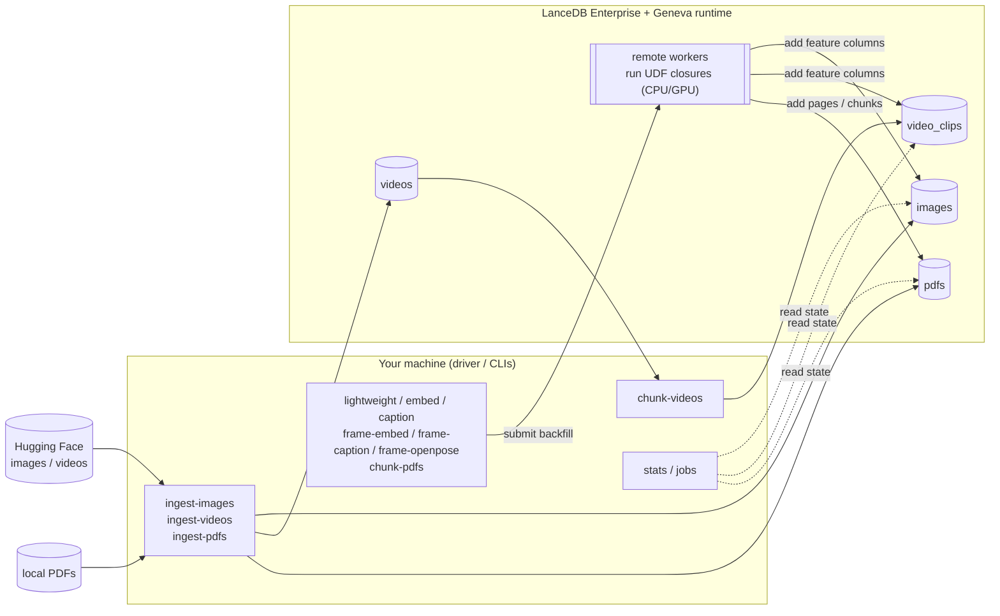

# geneva-examples — Geneva remote UDF examples

A self-contained set of **example UDFs** and the **submission tooling** to run
them against LanceDB Enterprise + a remote Geneva runtime. Point it at your Geneva
host, fill in three config values, and run a backfill.

What's here:

1. **Reusable Geneva UDFs** (in [`geneva_examples/udfs/`](geneva_examples/udfs/)):
   - `imageinfo` — lightweight CPU UDFs: byte size + image dimensions
   - `clip` — OpenCLIP image embeddings
   - `blip` — BLIP image captions
   - `openpose` — OpenPose pose-skeleton PNGs
   - `chunkers` — video-chunking UDTFs (split videos into fixed-length clips)
   - `pdf` — PDF page/text-chunk extraction, reusing Geneva's pre-built
     `geneva.udfs.document` UDFs (`extract_pages` + `chunk_pages`)
2. **Pipeline CLIs** that ingest data and submit the UDFs as Geneva backfills.
3. **Two inspection CLIs** — `stats` and `jobs` — that read table/job state over
   the same connection.
4. **UDF Studio** — a Gradio app for prototyping UDFs/chunkers locally before
   wiring them into a stage (see below).

The UDF bodies are self-contained closures: their imports and helpers are
nested inside the factory so they ship to the remote Geneva workers via the
pinned pip manifests and run there. The driver/CLI code stays lightweight.

## Architecture

The CLIs run **on your machine** (the driver). They only submit work: ingest CLIs
load source data into LanceDB Enterprise tables, and stage CLIs submit a Geneva
*backfill* that runs the UDF closures on **remote Geneva workers** (GPU-backed for
the model stages). The `stats`/`jobs` CLIs read table and job state over the same
connection.



## Repository layout

```text
geneva-examples/
├── geneva_examples/                  # the package: driver-side CLIs + reusable UDFs
│   ├── core/                         # config, connection, and shared helpers
│   │   ├── config.py                 # load config.yaml -> Config (creds, db_uri, S3, hf_token)
│   │   ├── common.py                 # setup_logging, connect(), Ray memory sizing
│   │   ├── package_specs.py          # resolve remote-runtime pip pins from installed versions
│   │   ├── _types.py                 # structural Protocols for the Geneva/LanceDB objects
│   │   └── utils/
│   │       ├── images.py             # load HF images / decode stored PNGs -> Arrow batches
│   │       ├── videos.py             # download MP4s + normalize OpenVid reference rows
│   │       ├── pdfs.py               # read local *.pdf files -> Arrow batches
│   │       ├── retry.py              # retry_io(): backoff + jitter for flaky table writes
│   │       └── tables.py             # wait_for_columns(): poll until a new column is visible
│   ├── udfs/                         # reusable @geneva.udf / @geneva.chunker factories + RUNTIME_PIP
│   │   ├── imageinfo.py              # CPU UDFs: byte size + image dimensions
│   │   ├── clip.py                   # OpenCLIP image embeddings (GPU)
│   │   ├── blip.py                   # BLIP image captions (GPU)
│   │   ├── openpose.py               # OpenPose pose-skeleton PNGs (GPU)
│   │   ├── chunkers.py               # video-chunking UDTFs (raw bytes + OpenVid blob source)
│   │   └── pdf.py                    # wrap geneva.udfs.document extract_pages / chunk_pages
│   ├── pipeline/                     # ingest + backfill CLIs (the driver commands)
│   │   ├── ingest_images.py          # load a HF image dataset -> images table
│   │   ├── ingest_videos.py          # download MP4s -> videos table
│   │   ├── ingest_videos_openvid.py  # register reference-only OpenVid rows
│   │   ├── ingest_pdfs.py            # load local PDFs -> pdfs table
│   │   ├── chunk_videos.py           # split videos -> video_clips (materialized view)
│   │   ├── chunk_videos_openvid.py   # chunk by reading blobs from the OpenVid source
│   │   ├── seed_video_clips.py       # synthesize clips to load-test the frame stages
│   │   ├── cleanup.py                # drop the video/clip (and optional pdfs) tables
│   │   └── stages/                   # single-column backfill CLIs (submit a Geneva backfill)
│   │       ├── _runner.py            # backfill_column(): shared drop/add/wait/backfill flow
│   │       ├── lightweight.py        # file_size + dimensions on images (CPU)
│   │       ├── embeddings.py         # OpenCLIP embedding on images (+ optional search demo)
│   │       ├── captions.py           # two BLIP caption variants on images
│   │       ├── frame_embed.py        # OpenCLIP embedding on each clip's frame
│   │       ├── frame_caption.py      # BLIP caption on each clip's frame
│   │       ├── frame_openpose.py     # OpenPose skeleton on each clip's frame
│   │       └── pdf_chunks.py         # pages + chunks backfill on the pdfs table (CPU)
│   ├── ops/                          # read-only inspection CLIs
│   │   ├── stats.py                  # summarize tables: rows, schema, feature columns
│   │   └── jobs.py                   # list / show / tail / kill Geneva backfill jobs
│   └── apps/                         # local (non-cluster) apps
│       ├── udf_studio.py             # Gradio prototyping app (Typer entrypoint + UI)
│       └── studio/
│           ├── runner.py             # execute edited transform()/chunk() over samples
│           ├── samples.py            # load sample inputs per modality from a data dir
│           ├── templates.py          # starter UDF/chunker code snippets
│           └── library.py            # save/load WIP functions in a local LanceDB
├── tests/                            # pytest suite (cluster boundary mocked)
│   ├── conftest.py                   # synthetic-media fixtures (PNG/MP4/PDF, sample data dir)
│   ├── _fakes.py                     # fake `geneva` module + FakeConn/FakeTable
│   └── test_*.py                     # unit tests + CliRunner wiring smoke tests
├── reports/                          # author-only PDF write-ups (reportlab; macOS fonts; not packaged)
├── studio_data/                      # UDF Studio sample-data dir (media gitignored; input.csv tracked)
├── config-example.yaml              # config.yaml template — copy and fill in
├── pyproject.toml                    # deps, cluster pins, Gemfury indexes, ruff/ty/pytest/coverage config
├── Makefile                          # dev tasks: install, check, audit, lint, format, test, typecheck…
├── CONTRIBUTING.md                   # setup, conventions, how to add a UDF or stage
├── SECURITY.md                       # security policy
└── .github/
    ├── workflows/ci.yml              # lint + format + tests/coverage + ty + pip-audit + secret scan
    └── dependabot.yml                # weekly dep + actions updates (cluster pins ignored)
```

## Requirements

- Python ≥ 3.12 and [`uv`](https://docs.astral.sh/uv/).
- A LanceDB Enterprise API key + region, and a reachable Geneva host URL.
- A GPU-backed Geneva runtime for the embed/caption/openpose stages — those
  models run **remotely** in the Geneva workers, not on your machine.

## Install

```bash
uv sync
```

`geneva`, `lancedb`, and `pylance` are pinned betas served from public Gemfury
indexes (declared in [`pyproject.toml`](pyproject.toml)); `uv` resolves them
automatically — no extra flags.

### Two tiers of version pins

There are **two independent** sets of versions, and they are deliberately not the
same thing:

1. **The client/driver env** — `pyproject.toml` + `uv.lock`, what runs on your
   machine. Refresh it with `uv lock --upgrade` (the `==` cluster pins for
   `geneva`/`lancedb`/`pylance` hold; everything else moves to latest).
2. **The remote-worker runtime** — the `*_RUNTIME_PIP` manifests in
   [`geneva_examples/udfs/`](geneva_examples/udfs/), the pip set each Geneva
   worker installs. `geneva`/`lancedb`/`pylance` there track the installed
   client versions via `package_spec()` (so client and cluster match), but
   `torch`/`transformers`/`pyarrow`/… are **exact-pinned independently** for
   reproducible worker builds. Bumping the client lock does **not** change them
   — edit the `*_PACKAGE_SPEC` defaults (or set the matching env var) when you
   want the GPU workers on newer versions.

## Configure

All configuration lives in a single YAML file — there is no environment-variable
fallback.

```bash
cp config-example.yaml config.yaml
# edit config.yaml
```

`config.yaml` is gitignored; `config-example.yaml` is the tracked template.

| Key               | Required | Default           | Description                                  |
| ----------------- | -------- | ----------------- | -------------------------------------------- |
| `lancedb_api_key` | **yes**  | —                 | LanceDB Enterprise API key.                  |
| `lancedb_region`  | **yes**  | —                 | LanceDB Enterprise region.                   |
| `geneva_host`     | **yes**  | —                 | Reachable Geneva runtime URL (load balancer).|
| `db_uri`          | no       | `db://quickstart` | Database URI, shared by every CLI.           |
| `s3_*`            | no       | —                 | S3 storage creds (all four or none).         |
| `hf_token`        | no       | —                 | Hugging Face token (raises HF rate limits).  |

A missing `config.yaml`, or one missing any required field, fails with a clear
error.

Table names aren't config — each CLI declares its own `--table-name` default
(`images` for the image workflow, `videos`/`video_clips` for video, `pdfs` for
PDFs). Pass `--table-name` (or `--table` on `stats`) to point a command
elsewhere.

## Image workflow

```bash
uv run ingest-images   # create the table + load images from a Hugging Face dataset
uv run lightweight     # backfill file_size + dimensions (CPU)
uv run embed           # backfill OpenCLIP embeddings (GPU); runs a local text-to-image
                       # search demo after — add --no-search-demo to skip (no driver torch)
uv run caption         # backfill two BLIP caption variants (GPU)
```

## Video workflow

```bash
uv run ingest-videos   # download MP4s into the `videos` table
uv run chunk-videos    # split into fixed-length clips + start frame -> `video_clips`
uv run frame-embed     # OpenCLIP embedding on each clip's frame
uv run frame-caption   # BLIP caption on each clip's frame
uv run frame-openpose  # OpenPose pose-skeleton PNG on each clip's frame
uv run cleanup         # drop the `videos` + `video_clips` tables
```

There is also an OpenVid variant (`ingest-videos-openvid` → `chunk-videos-openvid`)
that registers reference-only rows and chunks by reading the blob from the source
dataset, plus `seed-video-clips` for load-testing the frame stages without a full
chunk run. Run any CLI with `--help` for its options (e.g. `--chunk-seconds`,
`--model-name`/`--pretrained`/`--dim` on `frame-embed`).

## PDF workflow

Extract text chunks from your own PDFs. `ingest-pdfs` loads every `*.pdf` under
`--pdf-dir` into a `pdfs` table (`doc_id` + `pdf_bytes`); `chunk-pdfs` then
backfills two nested-list columns using Geneva's pre-built
`geneva.udfs.document` UDFs — `pages` (per-page text via `pypdf`) and `chunks`
(overlapping windows via LangChain's `RecursiveCharacterTextSplitter`, 2048
chars / 200 overlap). Both stages run on the **CPU** pool.

```bash
uv run ingest-pdfs --pdf-dir ~/my-pdfs   # load PDFs into the `pdfs` table
uv run chunk-pdfs                        # backfill `pages` + `chunks` (CPU)
```

Each PDF stays one row, carrying its `pages`/`chunks` lists — ready to embed or
explode into a per-chunk table. Prototype a PDF function first in UDF Studio
(the `pdf` modality, below) before wiring in a stage.

## Inspecting state

```bash
uv run stats                   # summarize images, videos, video_clips: rows, schema, feature columns
uv run stats --table pdfs      # summarize a specific table (repeatable)

uv run jobs                    # list active (PENDING/RUNNING) backfill jobs
uv run jobs --all              # include DONE/FAILED/CANCELLED
uv run jobs --table images     # filter by table; --status filters by exact state
uv run jobs show <job_id>      # full record for one job (--full-events for the whole log)
uv run jobs tail <job_id>      # follow a job's events until it reaches a terminal state
uv run jobs kill <job_id>      # cancel a job (prompts; -y to skip, --force if already terminal)
```

`stats` defaults to the example tables (`images`, `videos`, `video_clips`) and
skips any that are absent. Both CLIs connect via `config.yaml` (override with
`--config`/`--db-uri`).

## UDF Studio

A Gradio app for prototyping UDFs and chunkers before wiring them into a stage.
Pick a template, point it at sample data on disk, and run your function
**locally on the driver** (no Ray, GPU, or cluster) to see its output.

```bash
uv run udf-studio                 # http://127.0.0.1:7860, samples from ./studio_data
uv run udf-studio --data-dir ~/my-samples --library ~/udf-lib
```

> **Security.** Studio runs the code in the editor **in-process with no
> sandbox** — keep it on the default loopback bind (`127.0.0.1`). `--host
> 0.0.0.0` or `--share` exposes arbitrary code execution to anyone who can reach
> the port; only use them on a network you trust.

- **Contract.** A UDF defines `transform(value)` (one input → one output); a
  chunker defines `chunk(value)` that yields one `dict` per output row. Code at
  module level runs once per Run, so load models there.
- **Sample data** comes from `--data-dir` (default `studio_data/`): drop files
  into `images/`, `videos/`, `audio/`, `pdfs/`, or rows into `input.csv` (text).
  See [`studio_data/README.md`](studio_data/README.md). The sample media itself
  is gitignored — add your own.
- **Library.** Save/load work-in-progress to a local LanceDB at `--library`
  (default `udf_library/`).
- It never builds a manifest or submits to the cluster — promoting a finished
  function to a `geneva_examples/udfs/` factory + a stage CLI stays a manual step.

## Troubleshooting & tuning

| Symptom | Where to look |
| ------- | ------------- |
| **`config file not found` / `missing required config`** | Copy `config-example.yaml` to `config.yaml` and fill in `lancedb_api_key`, `lancedb_region`, `geneva_host`. There is no env-var fallback. |
| **`declare_table` 500s / version errors** | The client must match the deployed cluster. Keep the `geneva`/`lancedb`/`pylance` pins in `pyproject.toml` aligned with the cluster build. |
| **A feature column stays `NULL` after a stage** | The backfill is async. Check it with `uv run jobs` (add `--all` for terminal states). A stage logs `null_<column>` once it returns — a non-zero count means rows were skipped (e.g. unreadable input). |
| **`required columns not visible`** | `add_columns` hasn't propagated yet. Raise `--schema-wait-attempts` / `--schema-wait-sleep-s` on the stage. |
| **Job stuck PENDING or running slowly** | Inspect with `uv run jobs`; cancel with `uv run jobs kill <job_id>`. The cluster needs free (GPU) capacity for the embed/caption/openpose stages. |
| **HF rate limits during ingest** | Set `hf_token` in `config.yaml`. |

Every stage exposes the backfill knobs as CLI options (see `--help`); defaults are
tuned for the example datasets:

| Option | Default | What it controls |
| ------ | ------- | ---------------- |
| `--backfill-concurrency` | 32 | Parallel tasks; raise to use more workers, lower to ease cluster pressure. |
| `--backfill-task-size` | 256 | Rows per task — the unit of distribution. |
| `--backfill-checkpoint-size` | 128 | Rows between checkpoints; smaller = more durable, more overhead. |
| `--backfill-flush-interval-s` | 30 | Max seconds before a partial checkpoint flush. |
| `--backfill-timeout-min` | 1000 | Per-backfill timeout. |
| `--use-cpu-only-pool` | on (CPU stages) | Route to the CPU pool; the model stages use the GPU pool. |

## Development

```bash
make install     # sync deps + install the pre-commit hook
make check       # lint + format-check + tests (the CI gate)
make test        # pytest with coverage (90% gate, enforced via pyproject)
make typecheck   # ty (preview type checker; non-blocking)
make audit       # pip-audit the locked deps for CVEs (mirrors CI)
```

Run `make help` for the full target list.

Tests run without a cluster, GPU, or model weights: the Geneva boundary is
mocked (`tests/_fakes.py`) and heavy libraries are imported lazily. They cover
the pure helpers, config loading, the UDF manifests and lightweight UDFs/chunkers
run for real, the `stats`/`jobs` formatting helpers, and every CLI's wiring via
`typer`'s `CliRunner` — the ingest, chunk, stage, cleanup, and `jobs kill`
commands all have mocked smoke tests. Coverage is gated at 90% (CI also renders a
per-file coverage table into the run summary).

CI (`.github/workflows/ci.yml`) runs ruff lint + format, the test/coverage gate,
a non-blocking `ty` pass, a `pip-audit` dependency scan, and a TruffleHog secret
scan. See [`CONTRIBUTING.md`](CONTRIBUTING.md) for conventions and how to add a
new UDF or stage.
