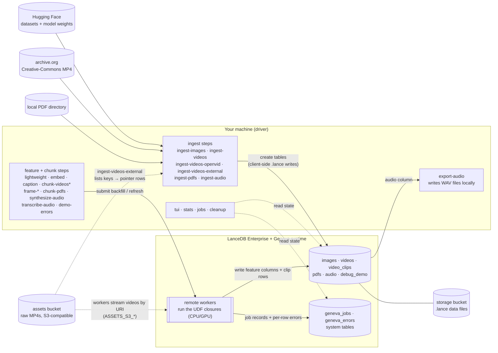

# Architecture

> Part of the geneva-examples docs — index: [docs/README.md](../README.md).

## Contents

- [What this repo is](#what-this-repo-is)
- [Topology](#topology)
- [Data flow per example](#data-flow-per-example)
- [Repository layout](#repository-layout)
- [Load-bearing invariants](#load-bearing-invariants)

## What this repo is

geneva-examples is a repository of runnable example pipelines for Geneva, LanceDB's
distributed UDF engine — not a library to depend on. It contains five examples
(images, video, pdf, audio, debugging), each an ordered chain of steps that ingests
source data into LanceDB tables and then fills feature columns with UDF backfills or
builds a chunker materialized view. The registry of examples is
`geneva_examples/examples/__init__.py`.

Every step is described once by a declarative spec (`Example` → `Step` → `Param` in
`geneva_examples/core/spec.py`), and two front-ends render from it: the generated
`uv run <step>` commands and the interactive TUI (`uv run tui`). That machinery is
covered in [docs/concepts/spec-and-cli-generation.md](spec-and-cli-generation.md).

Everything runs in one of two modes. In local mode the pipeline runs entirely on
your machine against an on-disk Lance database; in enterprise mode the driver talks
to LanceDB Cloud and a remote Geneva runtime. Mode selection and every config key
are covered in
[docs/getting-started/configuration.md](../getting-started/configuration.md).

## Topology

The step commands always run on your machine — the **driver**. Ingest steps load
source data into tables; feature steps submit a backfill (and chunk steps a
materialized-view refresh) that executes the UDF closures; the ops CLIs (`stats`,
`jobs`, `cleanup`) and the TUI work over the same connection — `stats` and the TUI
read table and job state, `jobs` can also cancel jobs, and `cleanup` drops tables.
Where the UDF closures execute depends on the mode:

| | Local mode | Enterprise mode |
|---|---|---|
| Database | on-disk Lance DB at `local_db_path` (default `./local_db`) | LanceDB Cloud (`db://…`) |
| UDF execution | a local Ray instance, provisioned per run | remote Geneva **workers** (CPU/GPU pools) |
| Worker packaging | none — workers share the driver env (`manifest=None`) | a pip **manifest** built per run |
| Secrets required | none | `lancedb_api_key`, `lancedb_region`, `geneva_host` |

The diagram shows the enterprise topology; in local mode everything inside the
"LanceDB Enterprise + Geneva runtime" group collapses onto your machine. Every fact
in the diagram is restated in the prose below it.

- **Sources.** Hugging Face supplies the image dataset, the OpenVid Lance dataset,
  and model weights. `ingest-videos` downloads a Creative-Commons MP4 over HTTPS
  from archive.org into `./video_cache`
  (`geneva_examples/examples/video/ingest.py`). `ingest-pdfs` reads a local PDF
  directory. The **assets
  bucket** is a separate S3-compatible bucket of raw MP4s used by the external-refs
  video variant: `ingest-videos-external` lists its keys into pointer rows, and the
  matching chunk step's workers later stream each video by URI. The audio and
  debugging examples need no external source — their ingest steps seed hardcoded
  text prompts and `(id, value)` rows (`geneva_examples/examples/audio/ingest.py`,
  `geneva_examples/examples/debugging/seed_errors.py`).
- **Driver.** Ingest steps create tables and write the `.lance` data files
  client-side, using the **storage bucket** credentials (`s3_*` /
  `azure_account_*`) as the connection's `storage_options`
  (`geneva_examples/core/config.py`). Feature and chunk steps only submit work.
  `export-audio` is the one step whose output is local files rather than a column:
  it scans the `audio` table on the driver and writes WAV files to disk.
- **Tables.** The five examples create `images`, `videos`, `video_clips`, `pdfs`,
  `audio`, and `debug_demo`. Geneva also maintains two **system tables** per
  database: `geneva_jobs` (job records) and `geneva_errors` (per-row UDF failures).
  Column-level detail lives in
  [docs/reference/tables-and-schemas.md](../reference/tables-and-schemas.md).
- **Workers.** Remote workers execute the UDF closures and write feature columns
  and clip rows back to the tables; job progress and per-row errors land in the
  system tables. For the external-refs video variant, workers read the assets
  bucket through the `ASSETS_S3_*` environment contract
  ([docs/reference/environment-variables.md](../reference/environment-variables.md)).
- **Ops.** `stats` and the TUI read tables and job records over the same
  connection; `jobs` can also cancel a job, and `cleanup` drops `videos` /
  `video_clips` (plus `pdfs` with `--pdfs-table`) after a
  confirmation prompt that `--yes` skips. None of them launches workers
  ([docs/workflows/inspecting-state.md](../workflows/inspecting-state.md)).

The storage bucket and the assets bucket use independent credential sets with no
fallback in either direction; see
[docs/getting-started/configuration.md](../getting-started/configuration.md).

## Data flow per example

| Example | Tables | Step chain |
|---|---|---|
| images | `images` | `ingest-images`, then any of `lightweight` / `embed` / `caption` — each backfills columns onto `images` |
| video | `videos` → `video_clips` | one ingest variant (`ingest-videos`, `ingest-videos-openvid`, or `ingest-videos-external`) → its paired chunk step (`chunk-videos`, `chunk-videos-openvid`, `chunk-videos-external`) creates `video_clips` as a materialized view → `frame-embed` / `frame-caption` / `frame-openpose` backfill columns onto `video_clips`. `seed-video-clips` instead writes a plain (non-view) `video_clips` table for load tests |
| pdf | `pdfs` | `ingest-pdfs` → `chunk-pdfs` (backfills `pages`, then `chunks`) |
| audio | `audio` | `ingest-audio` → `synthesize-audio` → `transcribe-audio` → `export-audio` (writes WAV files to disk; adds no column) |
| debugging | `debug_demo`, plus rows in `geneva_errors` | `demo-errors` — a single step that seeds the table and backfills a deliberately faulty `score` column under `skip_on_error` |

Per-example tutorials live under `docs/workflows/` (for example
[docs/workflows/video.md](../workflows/video.md)); per-command flags live in the
generated [docs/reference/cli/index.md](../reference/cli/index.md). Why
`video_clips` is a materialized view — and what that requires of its source — is
explained in [docs/concepts/materialized-views.md](materialized-views.md).

## Repository layout

| Path | What lives there |
|---|---|
| `geneva_examples/core/` | Shared infrastructure: `config.py` (YAML → `Config`), `common.py` (mode-aware plumbing), `backfill.py` (the backfill contract), `spec.py` (the spec + CLI generator), `jobs.py` (job-record rendering), `package_specs.py` (worker pip pins), `_types.py` (typing Protocols), `utils/` (loaders, retries, schema waits) |
| `geneva_examples/examples/__init__.py` | The registry: `EXAMPLES = (IMAGES, VIDEO, PDF, AUDIO, DEBUGGING)` |
| `geneva_examples/examples/cli.py` | Generated console-script commands, one per step |
| `geneva_examples/examples/_shared/` | OpenCLIP and BLIP UDF factories shared across examples |
| `geneva_examples/examples/images/` | Image example: spec + ingest / lightweight / embed / caption |
| `geneva_examples/examples/video/` | Video example: spec + three ingest variants, three chunkers, three frame stages, seed |
| `geneva_examples/examples/pdf/` | PDF example: spec + ingest / chunk (adopts geneva's shipped document UDFs) |
| `geneva_examples/examples/audio/` | Audio example: spec + ingest / synthesize / transcribe / export |
| `geneva_examples/examples/debugging/` | Debugging example: spec + the deliberately faulty `demo-errors` step |
| `geneva_examples/tui/` | The Textual TUI (`app.py`, `forms.py`) |
| `geneva_examples/ops/` | Inspection/teardown CLIs: `stats`, `jobs`, `cleanup` |
| `geneva_examples/apps/` | UDF Studio (Gradio): `udf_studio.py` + `studio/` |
| `geneva_examples/docs_gen/` | The docs generator behind `make docs` (CLI reference, worker pins, `llms.txt`) |
| `tests/` | pytest suite; the geneva boundary is mocked (`tests/_fakes.py`, `tests/conftest.py`) |
| `docs/` | This documentation tree; `docs/reference/cli/` and `docs/reference/worker-runtime-pins.md` are generated |
| `reports/` | Author-only reportlab PDF write-ups; not packaged, excluded from tests |
| `studio_data/` | UDF Studio sample-data layout (media gitignored; `input.csv` tracked) |
| `udf_library/` | Gitignored, created at runtime: UDF Studio's saved-UDF library, the default `--library` directory (`geneva_examples/apps/udf_studio.py`) |
| `config-example-local.yaml`, `config-example-enterprise.yaml` | The two tracked config templates; copy one to `config.yaml` (gitignored) |
| `pyproject.toml` | Dependencies + cluster pins, Gemfury indexes, `[project.scripts]`, tool config |
| `Makefile` | Dev tasks; run `make help` for the authoritative list |
| `.rayignore` | Excludes caches and local databases from Ray `working_dir` uploads (Ray's 512 MiB limit) |
| `.github/` | CI workflow and Dependabot config |
| `llms.txt` | Machine-readable docs index for agents (generated by `make docs`) |
| `LICENSE` | Apache-2.0. Example commands additionally download third-party datasets and models governed by their own licenses |

## Load-bearing invariants

Three properties of this codebase are relied on everywhere. Breaking any of them
breaks things far from the edit.

### The registry is import-cheap

Importing `geneva_examples/examples/__init__.py` must pull in neither `torch` nor
`geneva`; `tests/test_registry.py` enforces this with a subprocess import check.
Every `run()` body and UDF factory therefore nests its heavy imports, and anything
that only lists or describes steps — TUI startup, `--help`, the docs generator —
stays fast and needs neither the ML stack nor credentials. Preserve this when
adding steps ([docs/authoring/adding-a-step.md](../authoring/adding-a-step.md)).

### Spec descriptions are user-facing documentation

`Step.description` renders into `uv run <step> --help`, the TUI's markdown pane,
and the generated CLI reference
([docs/reference/cli/index.md](../reference/cli/index.md)); `Example.description`
renders into the TUI and the generated reference page (markdown-escaped by
`geneva_examples/docs_gen/render.py`). Editing a step description edits three
surfaces at once; run `make docs` afterwards so the generated pages match.

### One Ray session per run (local mode)

In local mode, `runtime_session()` provisions a single local Ray instance for the
whole run and tears it down on exit, so it must wrap the entire backfill loop —
never each column individually (`geneva_examples/core/common.py`). This is also why
`chunk-videos-external --detach` falls back to a synchronous refresh in local mode:
a detached job would outlive the run's Ray session
([docs/workflows/video.md#detached-refresh](../workflows/video.md#detached-refresh)).
In enterprise mode
`runtime_session()` is a no-op and the work runs on the remote cluster.
